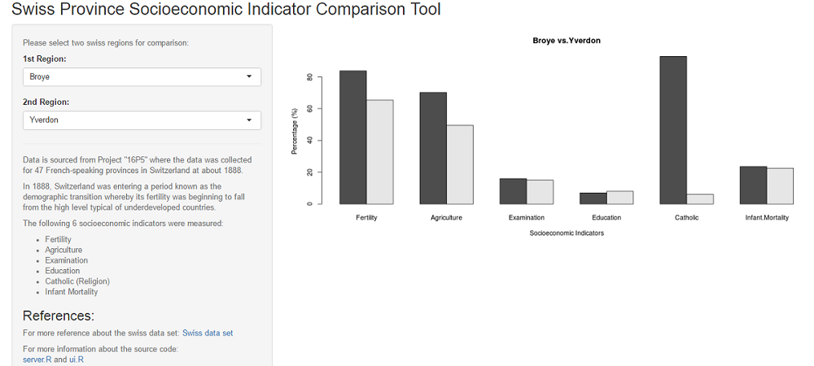

## Background

- The app allows comparison of socioecnomic indicators of Swiss Provinces
- The data collected are for 47 French-speaking provinces of Switzerland at about 1888
- 1888 is the year Switzerland was entering a period known as the demographic transition
- Demographic transition is when e.g. fertility was beginning to fall from the high level typical of underdeveloped countries

--- .class #id 

## Socioeconomic Indicators Measured

- **Fertility**: common standardized fertility measure
- Agriculture: % of males involved in agriculture as occupation
- Examination: draftees receiving highest mark on army examination
- Education: % education beyond primary school for draftees.
- Catholic (Religion): as opposed to Protestant
- Infant Mortality: live births who live less than 1 year

--- .class #id 

## Socioeconomic Indicators Measured

- Fertility: common standardized fertility measure
- Agriculture: % of males involved in agriculture as occupation
- Examination: draftees receiving highest mark on army examination
- Education: % education beyond primary school for draftees.
- Catholic (Religion): as opposed to Protestant
- Infant Mortality: live births who live less than 1 year

--- .class #id 

## Socioeconomic Tool

How to use the tool?  
Just select 1st Region and 2nd Region from the drop down to compare the socioeconomic indicators for the two regions:

--- .class #id 

## References
- Data Source Description:

[https://vincentarelbundock.github.io/Rdatasets/doc/datasets/swiss.html](https://vincentarelbundock.github.io/Rdatasets/doc/datasets/swiss.html)

- Embedded R code and html files for the slidify presentation:

--- .class #id 

